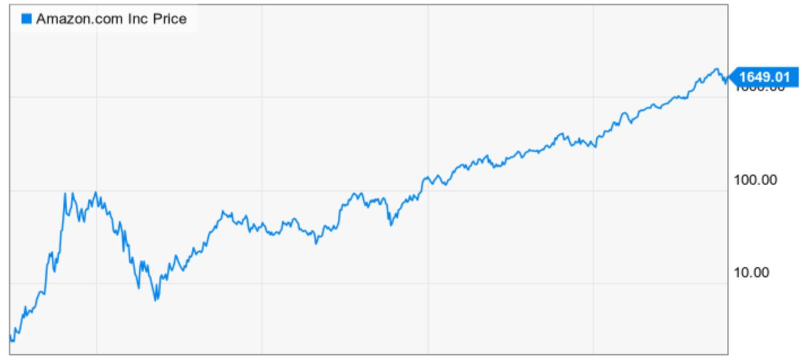

# Buy and Sell Once

## Goal
Given is the price-development of an arbitrary stock.

Suppose you have perfect knowledge and are able to buy and sell the stock once.
Write an algorithm that outputs the maximum profit that can be made.

 * The price-development is given for an arbitrary number of days.  
 * A stock can only be sold on the next day. 
 * Stock-prices are given as integers
  
### Input
A blank-separated array of stock-prices. 

Each position symbolises the stock-price of a given day.

### Output
The maximum profit that can be made within that day.
    
### Constraints
 * 2 <= `days with stock-prices` <= 50
 * 1 <= `stock-price` <= 2,147,483,647

### Example
**Input:** 
`310 315 275 295 260 270 290 230 255 250`

**Output:** 
`30`